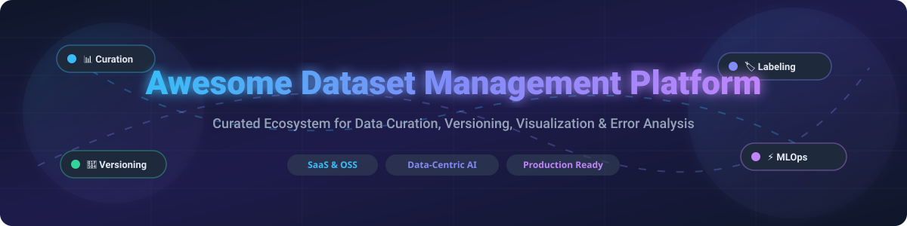

  

# 🚀 Awesome Dataset Management Platform

> ⚡ **A curated list of top SaaS products and open-source GitHub projects for Dataset Management, Versioning, Dataset Curation, Visual Exploratory Data Analysis (EDA), and Model Error Analysis.**

---

## 📚 Table of Contents
- [🌐 SaaS / Hosted Platforms](#-saas--hosted-platforms)
- [🔓 Open-Source GitHub Projects](#-open-source-github-projects)
- [🤝 How to Contribute](#-how-to-contribute)
- [☕ Support](#-support)
- [⚠️ Disclaimer](#%EF%B8%8F-disclaimer)
- [📈 Star History](#-star-history)

---

## 🌐 SaaS / Hosted Platforms

> 📊 **Market Insights**: The global Data Management and MLOps market size is estimated at **$12.5 Billion+ in 2026** and is growing at over 25% CAGR. The sector is **moderately fragmented**, with category leaders like Hugging Face and CoreWeave/W&B anchoring public infrastructure and experiment tracking, while specialized platforms address niche modalities and visual data curation.

Below is a comparison of leading SaaS dataset management platforms sorted by company size (valuation / ARR descending):

| 🏢 Platform | 💰 Company Size (Valuation / ARR) | 🏷️ Starting Paid Tier Price | 🎁 Free Tier Limits | 📝 Key Capabilities |
| :--- | :--- | :--- | :--- | :--- |
| **[Hugging Face Hub](https://huggingface.co/)** | **$12.9B Valuation** (Acquired by Nvidia for $12.9B in 2026; $150M ARR) | $9 / month (Pro plan) | $0.10 monthly inference credits, 2 ZeroGPU Spaces, free public datasets & model hosting | Largest open community platform for dataset discovery, model sharing, versioning, dataset viewers, and hosted ML apps. |
| **[Weights & Biases](https://wandb.ai/)** | **$1.7B Valuation** (Acquired by CoreWeave for $1.7B in 2025; ~$50M ARR) | $60 / month (Pro plan up to 10 seats) | 5 model seats, 5 GB storage/mo, 1 GB Weave data ingestion/mo | End-to-end MLOps platform featuring Artifacts for dataset versioning, model lineage, experiment tracking, and aliases. |
| **[Encord](https://encord.com/)** | **$550M Valuation** (Series C in 2026; ~$15M ARR) | $99 / month (Starter plan) | 14-day free trial with up to 1,000 unit annotations & 500 MB storage | Data-centric AI platform for visual dataset curation, quality management, model evaluation, and automated labeling across images, video, and audio. |
| **[Roboflow Universe](https://universe.roboflow.com/)** | **$300M Valuation** (Series B $40M; ~$12M ARR) | $79 / month (Core Plan billed annually) | Core plan at $0/mo including 10 API credits/mo, private projects, & model weight downloads | Comprehensive computer vision dataset platform providing dataset discovery, preprocessing, annotation, model training, and web host deployments. |
| **[Comet ML](https://www.comet.com/)** | **$254M Valuation** (Total funding $69.8M; ~$20M ARR) | $179 / month (Team tier starting) | 1 user seat, 5 GB storage, unlimited public projects | Machine learning platform offering experiment tracking, dataset versioning, model registry, and visual model error diagnostics. |
| **[Activeloop](https://activeloop.ai/)** | **$70M Valuation** (Series A $11M in 2024; ~$5M ARR) | $40 / user / month (Starter plan) | 14-day free trial with 50 GB Deep Lake storage | Deep Lake dataset format designed for AI-native multimodal data streaming, fast versioning, and LLM / computer vision vector storage. |
| **[Grid.ai](https://www.grid.ai/)** | **$60M Valuation** ($18.6M total funding) | $49 / month (Standard tier) | 14-day free trial with $50 compute credits | Cloud infrastructure platform built by creators of PyTorch Lightning for training models at scale with dataset caching and run tracking. |
| **[ClearML](https://clear.ml/)** | **$35M Valuation** ($7M funding; ~$4.5M ARR) | $15 / user / month (Pro plan) | Free self-hosted tier; Cloud free tier includes 100 GB storage & 3 user seats | Unified open-source MLOps suite featuring Data Management, dataset versioning, pipeline orchestration, and experiment monitoring. |
| **[DagsHub](https://dagshub.com/)** | **$20M Valuation** ($3.6M funding; ~$3M ARR) | $99 / user / month (Team plan) | Unlimited public repos, 10 GB storage & 100 tracked experiments in private repos | Collaborative data platform connecting Git, DVC, and MLflow for unified dataset versioning, data lineage, and experiment tracking. |

---

## 🔓 Open-Source GitHub Projects

Explore production-proven open-source tools for dataset curation, annotation, self-hosted dataset hubs, and dataset versioning.

Repositories sorted by GitHub Stars_Counts (descending):

| 📦 Repository & Stars | 🛠️ Category | 📜 License | 🌟 Highlights & Capabilities |
| :--- | :--- | :--- | :--- |
| **[iterative/dvc](https://github.com/iterative/dvc)**  | Dataset Versioning & Pipeline | Apache-2.0 | Git-for-data tool. Manages large datasets, model files, and ML pipelines alongside Git without bloating repositories. |
| **[cvat-ai/cvat](https://github.com/cvat-ai/cvat)**  | Annotation & Labeling | MIT | Powerful, mature open-source web annotation tool for computer vision (images, video, 3D point clouds) with AI auto-annotation (SAM). |
| **[voxel51/fiftyone](https://github.com/voxel51/fiftyone)**  | Curation & Error Analysis | Apache-2.0 | Leading open-source toolkit to explore, analyze, debug, and curate vision datasets, detect mislabels, visualize embeddings, and evaluate models. |
| **[HumanSignal/label-studio](https://github.com/HumanSignal/label-studio)**  | Annotation & Labeling | Apache-2.0 | Multi-modal data annotation tool supporting text, audio, images, video, and time-series data with custom ML backend integrations. |
| **[argilla-io/argilla](https://github.com/argilla-io/argilla)**  | LLM Data & Feedback | Apache-2.0 | Open-source platform for collecting human feedback (RLHF / DPO), dataset curation, and annotation for LLMs and NLP workflows. |
| **[Renumics/spotlight](https://github.com/Renumics/spotlight)**  | Dataset EDA & Curation | MIT | Interactive visual tool to explore unstructured datasets (images, audio, text, embeddings), identify data edge cases, and inspect model errors. |
| **[open-edge-platform/datumaro](https://github.com/open-edge-platform/datumaro)**  | Dataset Transformation | MIT | Dataset management framework & CLI for converting, building, analyzing, and merging computer vision dataset formats (COCO, Pascal VOC, YOLO). |
| **[OpenCSGs/csghub](https://github.com/OpenCSGs/csghub)**  | Self-Hosted HuggingFace Alt | Apache-2.0 | Open-source on-premise alternative to Hugging Face Hub for hosting and managing datasets, LLMs, and AI agents with Hugging Face SDK compatibility. |

---

## 🤝 How to Contribute

Contributions are warmly welcome! 

1. **Fork** the repository 🍴
2. **Add/Edit** entries in `README.md` following the standard table format.
3. Ensure details (pricing, limits, repository star links) are accurate and factual.
4. **Submit a Pull Request** with a clear explanation of your additions! 🚀

---

## ☕ Support

If you found this curated list helpful for your MLOps & Data-Centric AI projects, please consider supporting the project:

- ⭐ **Star** this repository to increase visibility.
- 🔀 **Fork** and share it with your fellow ML engineers and data scientists.
- 💖 **Sponsor / Buy a Coffee**: Consider supporting ongoing maintenance via the [GitHub Sponsor Dashboard](https://github.com/sponsors/ishandutta2007).

---

## ⚠️ Disclaimer

- This list is **community-curated** and maintained for informational purposes.
- Commercial platforms update their pricing, free tier allocations, and enterprise features frequently. Please verify specific details on official vendor websites before enterprise procurement.
- Dataset management systems store sensitive proprietary data—ensure enterprise governance, privacy policies, and security compliance (SOC 2, GDPR, HIPAA) when selecting solutions.

---

## 📈 Star History

